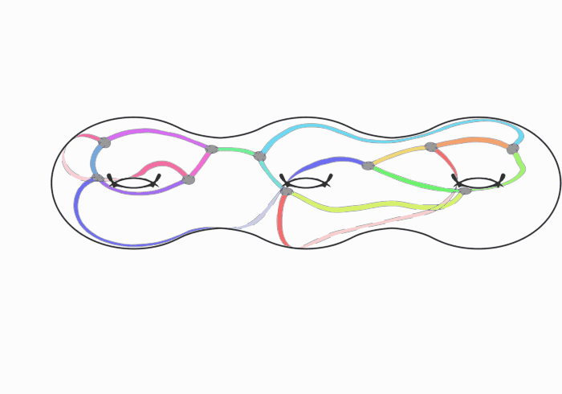

# String Amplitudes

<p align="center">
  <picture>
    <source
      media="(prefers-color-scheme: dark)"
      srcset="docs/_static/images/string_amplitudes_logo_white.svg"
    >
    
  </picture>
</p>

The long-term goal of `string-amplitudes` is to numerically compute higher genus string amplitudes for any CFT for which the conformal data is known. The ribbon graph parameterization of the moduli space of Riemann surfaces is a great way to do this, because the ribbon graphs give a global parameterization of the moduli space, and makes the actual integration relatively trivial.

At the moment, the repository supports the generation of the combinatorial and holomorphic data of the ribbon graphs with one face (i.e. puncture), and the computation of the critical bosonic string integrand. We have vierified that for genus two and three the ribbon graph computation agrees with the known expression in terms of the igusa cusp form. Eventually, support will be added for other partition functions (e.g. Liouville, superstring), and allow integration in your favorite moduli space coordinates (e.g. ribbon graph, period matrix, plumbing parameterization).

<p align="center">
  
</p>
A visualization of the embedding of one ribbon graph on a genus three surface.

## Installation

Clone the repository and install the package from its root directory:

```bash
python -m pip install .
```

The package requires Python 3.10 or later, NumPy, and NetworkX.

## Basic use

```python
from string_amplitudes import generate_ribbon_graphs, get_boundary_data

graphs = generate_ribbon_graphs(genus=2, n_faces=1)
boundary_data = get_boundary_data(graphs[0])
```


## Authors

Sam Christian, Ben Mazel, Yuchen Wang, Xi Yin, and Yutai Zhang.
