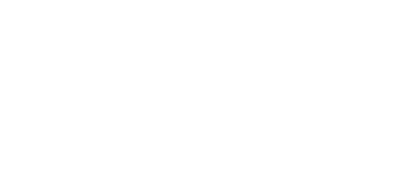

<div class="landing-page">
  <section class="landing-hero">
    <div class="landing-logo" aria-hidden="true">
      
      
    </div>
    <h1>String Amplitudes</h1>
    <p class="landing-summary">Numerical tools for evaluating string amplitudes.</p>
    <div class="landing-actions">
      <a class="landing-action landing-action-primary" href="get_started.html">Get started</a>
      <a class="landing-action landing-action-secondary" href="calculations.html">View calculations</a>
      <a class="landing-action landing-action-secondary" href="api/index.html">View API</a>
    </div>
  </section>
</div>

```{toctree}
:hidden:
:maxdepth: 1

get_started
Calculations <calculations>
API <api/index>
```
